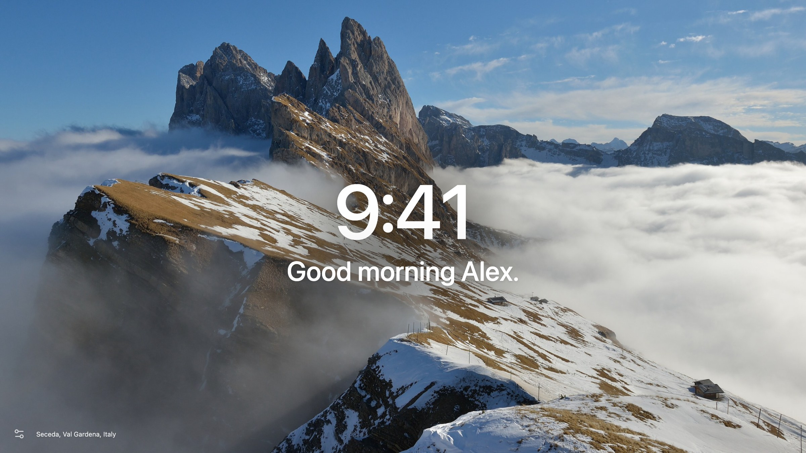
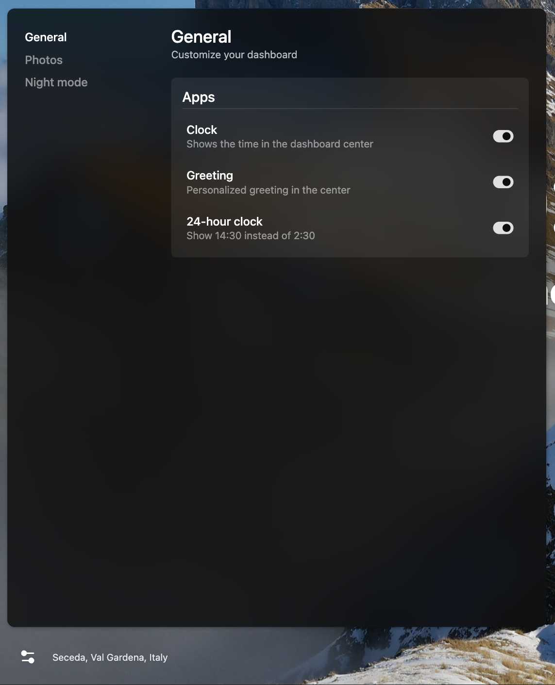
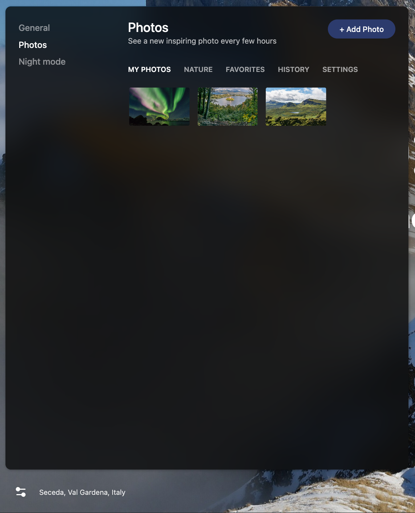
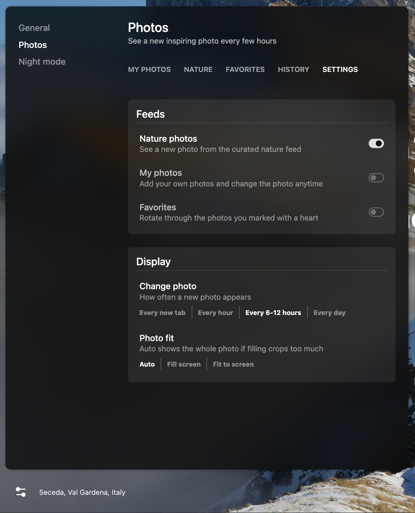
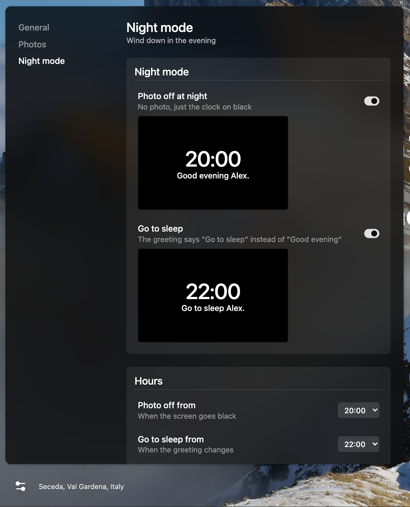

# Doorway

A free, open source Chrome new tab: a big clock, "Good morning Alex." and a beautiful photo behind it. Use your own photos or pick from 100 nature photos that come with it. It works offline and needs no account.

More at [pawelkica.com/doorway](https://pawelkica.com/doorway). Omakase style, so fork it or open an issue if you'd like something changed.



## Install

1. Clone the repo:
   ```
   git clone https://github.com/Pawel-Kica/doorway.git
   ```
2. In Chrome, go to `chrome://extensions` and turn on **Developer mode** (top right).
3. Click **Load unpacked** and pick the `extension` folder.
4. Open a new tab and you're done!

If another new tab extension is installed, turn it off, because only one extension can take over the new tab.

## How to use

Click the sliders icon in the bottom-left corner.

**General:** show or hide the clock and greeting, 24-hour clock. Hover the greeting and click "..." to add your name.



**Photos > My Photos:** click + Add Photo or drop images anywhere on the page. Hover a photo to edit its location or delete it.



**Photos > Settings:** pick where photos come from, how often they change, and how they fit the screen.



**Night mode:** from 20:00 the photo goes away and it's just the clock on black. From 22:00 the greeting says "Go to sleep". Turn either off or change the hours here.



Click the location text at the bottom left to favorite the photo or skip to the next one.

## Details

- Night mode ends at 4:00 by default, the same hour "Good morning" starts.
- Blocked websites (Settings > Distractions): type a site and it opens a black "blocked" page instead, subdomains included. `bbc.com` covers the whole site, `bbc.com/news` only that part. This is why the extension asks for access to all sites, it only uses it to redirect the ones on your lists.
- Think twice (Settings > Distractions): a site on this list first asks "Do you really need it?". Yes asks what you need there, then opens it in that tab until you close the tab, with your answer in a todo list in the top right corner (+ adds more). Once everything is checked, "I'm done!" takes you back to the new tab. Later saves a note, or the link you came from, to that site's list for next time. No takes you back to the new tab.
- Feeds: Nature photos, My photos and Favorites, turn on any mix and photos come from all of them. If they are all empty you get Nature photos.
- Change photo: every new tab, every hour, every 6-12 hours (default, random) or every day (at 4:00). No repeats until the enabled feeds run out.
- Photo fit: Fill screen crops the photo, Fit to screen shows all of it over a blurred copy. Auto (default) fits when filling would crop more than 35%.
- Your photos are shrunk to 2560px and saved in this Chrome profile (IndexedDB). Removing the extension deletes them.
- Nature photos are from Wikimedia Commons, credits in `extension/photos/stock.json`.

## Tests

Headless Playwright Chromium with a temp profile, never your real Chrome:

```
NODE_PATH=$(npm root -g) node tests/e2e.cjs
```

Screenshots land in `/tmp/doorway-shots/`.

## License

MIT for the code, see [LICENSE](LICENSE). Nature photos keep their Wikimedia Commons licenses, listed in `extension/photos/stock.json`.

The photos I use myself are in `my-photos/`, grab any you like. They aren't covered by the MIT license and belong to their photographers (the Bugatti Tourbillon shots are Bugatti press photos, the Starship launch is SpaceX's).
